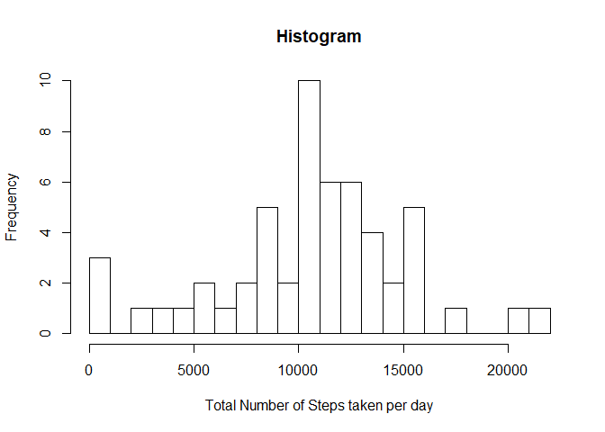
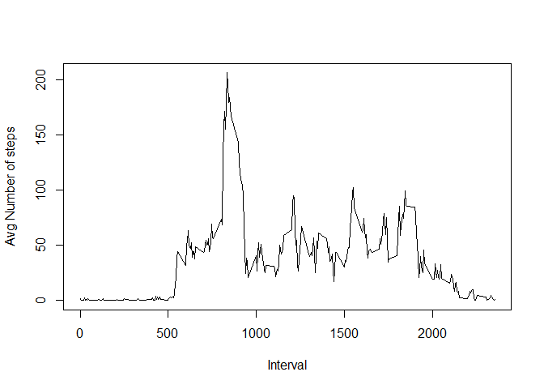
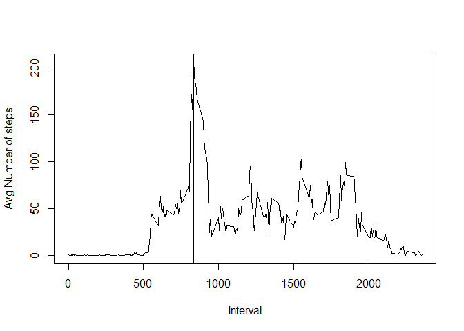
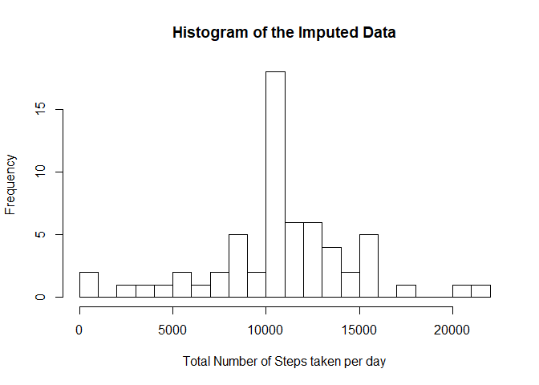
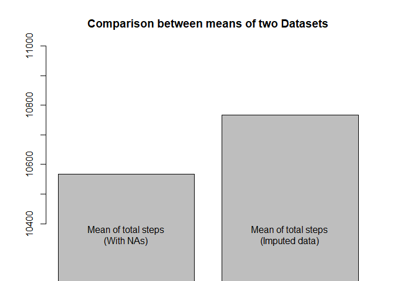
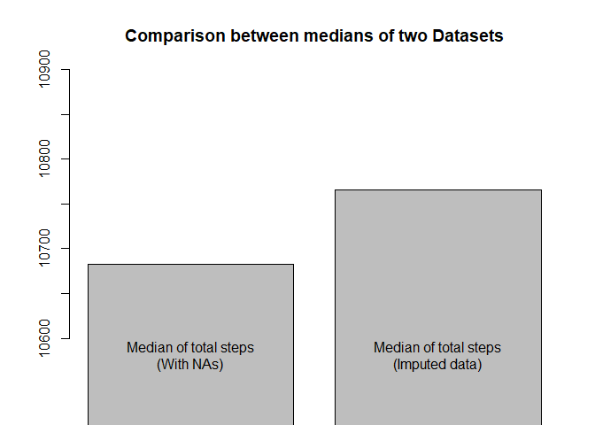

##Loading and preprocessing the data

Setting "echo=TRUE" for all code chunks

```r
library(knitr)
opts_chunk$set(echo=TRUE)
```

###Data Loading

```r
setwd("C:/Users/user/Desktop/Data Analytics Stuff/Coursera/Reproducible research")
activity<-read.csv("activity.csv",header=TRUE)
```

###Data Processing
Removing NAs

```r
act<-!(is.na(activity))
activity0<-activity[act,c(1:3)]
str(activity0)
```

```
## 'data.frame':	50400 obs. of  3 variables:
##  $ steps   : int  0 0 0 0 0 0 0 0 0 0 ...
##  $ date    : Factor w/ 61 levels "2012-10-01","2012-10-02",..: 2 2 2 2 2 2 2 2 2 2 ...
##  $ interval: int  0 5 10 15 20 25 30 35 40 45 ...
```

```r
head(activity0)
```

```
##     steps       date interval
## 289     0 2012-10-02        0
## 290     0 2012-10-02        5
## 291     0 2012-10-02       10
## 292     0 2012-10-02       15
## 293     0 2012-10-02       20
## 294     0 2012-10-02       25
```

##Mean of Total Number of steps taken per day

###Total Number of steps taken per day

```r
library(dplyr)
```

```
## 
## Attaching package: 'dplyr'
```

```
## The following objects are masked from 'package:stats':
## 
##     filter, lag
```

```
## The following objects are masked from 'package:base':
## 
##     intersect, setdiff, setequal, union
```

```r
activity1<-group_by(activity0,date) %>% summarize(total_steps=sum(steps,na.rm = TRUE))
head(activity1)
```

```
## # A tibble: 6 x 2
##   date       total_steps
##   <fct>            <int>
## 1 2012-10-02         126
## 2 2012-10-03       11352
## 3 2012-10-04       12116
## 4 2012-10-05       13294
## 5 2012-10-06       15420
## 6 2012-10-07       11015
```

###Histogram of the total number of steps taken each day

```r
hist(activity1$total_steps,breaks=20,xlab = "Total Number of Steps taken per day",main="Histogram")
```

<!-- -->

###Mean and Median of total number of steps taken per day

```r
mean(activity1$total_steps)
```

```
## [1] 10566.81
```

```r
median(activity1$total_steps)
```

```
## [1] 10682.5
```

##Average daily activity pattern

###1.Time Series Plot(With original data)

```r
activity2<-group_by(activity0,interval) %>% summarize(avg_no_of_steps=mean(steps))
plot(activity2$interval,activity2$avg_no_of_steps,xlab="Interval",ylab="Avg Number of steps",type="l")
```

<!-- -->

###2.Interval which contains on average Maximum Number of steps across all the days.

```r
plot(activity2$interval,activity2$avg_no_of_steps,xlab="Interval",ylab="Avg Number of steps",type="l")
abline(v=activity2$interval[which.max(activity2$avg_no_of_steps)])
```

<!-- -->

##Imputing Missing Values

###1.Total Number of Missing Values in the Dataset

```r
sum(is.na(activity))
```

```
## [1] 2304
```

###2.The strategy for filling in all of the missing values in the dataset

Mean for 5-minute interval is used to fill in the missing values in the dataset


```r
head(activity2)
```

```
## # A tibble: 6 x 2
##   interval avg_no_of_steps
##      <int>           <dbl>
## 1        0          1.72  
## 2        5          0.340 
## 3       10          0.132 
## 4       15          0.151 
## 5       20          0.0755
## 6       25          2.09
```

###3.The New imputed Dataset

```r
activity3<-activity
for(i in 1:nrow(activity3)){
  if(is.na(activity3$steps[i])){
    activity3$steps[i]<-activity2$avg_no_of_steps[which(activity2$interval==activity3$interval[i])]
  }
}
head(activity3)
```

```
##       steps       date interval
## 1 1.7169811 2012-10-01        0
## 2 0.3396226 2012-10-01        5
## 3 0.1320755 2012-10-01       10
## 4 0.1509434 2012-10-01       15
## 5 0.0754717 2012-10-01       20
## 6 2.0943396 2012-10-01       25
```


###4.Histogram(Imputed Dataset) of the total number of steps taken each day

```r
library(dplyr)
activity4<-group_by(activity3,date) %>% summarize(total_steps=sum(steps))
head(activity4)
```

```
## # A tibble: 6 x 2
##   date       total_steps
##   <fct>            <dbl>
## 1 2012-10-01      10766.
## 2 2012-10-02        126 
## 3 2012-10-03      11352 
## 4 2012-10-04      12116 
## 5 2012-10-05      13294 
## 6 2012-10-06      15420
```

```r
hist(activity4$total_steps,breaks=20,xlab = "Total Number of Steps taken per day",main="Histogram of the Imputed Data")
```

<!-- -->

###Mean and Median(Imputed Dataset) of total number of steps taken per day

```r
mean(activity4$total_steps)
```

```
## [1] 10766.19
```

```r
median(activity4$total_steps)
```

```
## [1] 10766.19
```

###Comparison between Dataset with missing Values and Dataset with Imputed Data.

```r
barplot(c(mean(activity1$total_steps),mean(activity4$total_steps)),names.arg=c("Mean of total steps\n(With NAs)","Mean of total steps\n(Imputed data)"),main="Comparison between means of two Datasets",ylim=c(10400,11000))
```

<!-- -->


```r
barplot(c(median(activity1$total_steps),mean(activity4$total_steps)),main="Comparison between medians of two Datasets",ylim=c(10600,10900),names.arg=c("Median of total steps\n(With NAs)","Median of total steps\n(Imputed data)"))
```

<!-- -->


##To check Differences in activity patterns between weekdays and weekends.

###1.New factor variable in the dataset with two levels - "weekday" and "weekend"

```r
library(chron)
for(i in 1:nrow(activity3)){
  if(is.weekend(activity3$date[i])){
    activity3$daytype[i]="Weekend"
  }
  else{
    activity3$daytype[i]="Weekday"
  }
}
activity3$daytype<-as.factor(activity3$daytype)
str(activity3)
```

```
## 'data.frame':	17568 obs. of  4 variables:
##  $ steps   : num  1.717 0.3396 0.1321 0.1509 0.0755 ...
##  $ date    : Factor w/ 61 levels "2012-10-01","2012-10-02",..: 1 1 1 1 1 1 1 1 1 1 ...
##  $ interval: int  0 5 10 15 20 25 30 35 40 45 ...
##  $ daytype : Factor w/ 2 levels "Weekday","Weekend": 1 1 1 1 1 1 1 1 1 1 ...
```

###2.Time Series Plot(on the basis of Day Type)

```r
activity5<-group_by(activity3,interval,daytype) %>% summarize(avg_no_of_steps=mean(steps))
library(ggplot2)
g<-ggplot(activity5,aes(interval,avg_no_of_steps))
g+geom_line()+facet_grid(daytype~.)+xlab("Interval")+ylab("Number of steps")
```

-1.png)<!-- -->
